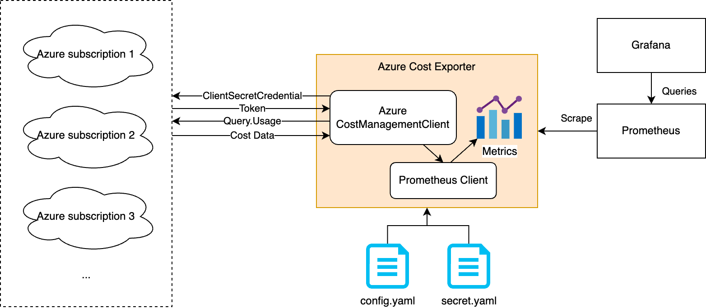

# Azure Cost Exporter

On Azure we usually use the Cost Management portal to analyze costs, which is a separate dashboard and it only contains cost information. What if we would like to see the trends of both costs and the business metrics? Azure Cost Explorter enables this idea by exposing Azure cost data as Prometheus metrics so that developers can have them together with other observability metrics, in the same place.

## Sample Output

```
# HELP azure_daily_cost_usd Daily cost of an Azure account in USD
# TYPE azure_daily_cost_usd gauge
azure_daily_cost_usd{ChargeType="ActualCost",EnvironmentName="prod",ProjectName="myproject",ServiceName="Virtual Network",Subscription="<subscription_id_1>",TenantId="<tenant_id_1>"} 0.439500230497108
azure_daily_cost_usd{ChargeType="ActualCost",EnvironmentName="prod",ProjectName="myproject",ServiceName="VPN Gateway",Subscription="<subscription_id_1>",TenantId="<tenant_id_1>"} 4.191000368311904
azure_daily_cost_usd{ChargeType="ActualCost",EnvironmentName="dev",ProjectName="myproject",ServiceName="Azure Container Apps",Subscription="<subscription_id_2>",TenantId="<tenant_id_2>"} 0.371846875438938
azure_daily_cost_usd{ChargeType="ActualCost",EnvironmentName="dev",ProjectName="myproject",ServiceName="Service Bus",Subscription="<subscription_id_2>",TenantId="<tenant_id_2>"} 13.99512952148999
...
```

*ps: As the metric name indicate, the metric shows the daily costs in USD. `Daily` is based a fixed 24h time window, from UTC 00:00 to UTC 24:00. `EnvironmentName` and `ProjectName` are the custom labels that can be configured. `ServiceName` is a label based on `group_by` configuration.*

## How Does This Work

Azure Cost Exporter calls Azure Cost Management API (`query.usage`) to fetch cost data. The following figure depicts the work flow of this exporter.



## Register Application on Azure, Get Credentials

In order to invoke Azure API, the exporter needs to be authenticated first. In the current implementation, it utilizes the client credentials approach. For each target Azure subscription, an application needs to be registered and assigned with the `Cost Management Reader` role.

Here are the steps of registering an application.

- Login to Azure portal (portal.azure.com).
- Visit `App registrations` page, and click the button `New registration`.
  - Specify a name.
  - Choose `Accounts in this organizational directory only (Single tenant)` as the account type.
- Visit `Subscriptions` page, choose the subscription that you would like to fetch cost data from.
  - Go to the `Access control (IAM)` page under the selected subscription.
  - Click `Add` - `Add role assignment`, under the `Role` tab, select `Cost Management Reader`, under the `Members` tag, assign access to `User, group, or service principal` and select the created application as the member, then review and assign the role.

Here are the steps of creating client credentials.

- Visit the application page via the `App registrations` portal or from the search textbox.
- Under the `Essentials` section, you will need the values of `Application (client) ID`, and `Directory (tenant) ID`.
- Go to `Certificates & secrets - Client secrets`, and click `New client secret`.
  - After clicking the `Add` button, remember to copy the client secret to a safe place because Azure only shows it once.

## Deployment

Modify the `exporter_config.yaml` file first, then run command `python main.py -c exporter_config.yaml` to generate a `secret.yaml` file. Put the credentials (client ID and client secret) of each Azure account into this file and then this use one of the following methods to run the exporter.

### Docker

```
docker run --rm -v ./exporter_config.yaml:/app/exporter_config.yaml -v ./secret.yaml:/app/secret.yaml -p 9090:9090 opensourceelectrolux/azure-cost-exporter:v1.0.1
```

### Kubernetes

- Create Namespace
```
kubectl create ns finops
```

- Create Secret
```
kubectl create secret generic azure-cost-exporter \
    --namespace=finops \
    --from-file=./secret.yaml
```

- Create ConfigMap
```
kubectl create configmap azure-cost-exporter-config --namespace finops --from-file=./exporter_config.yaml
```

- Create Deployment
```
kubectl create --namespace finops -f ./deployment/k8s/deployment.yaml
```